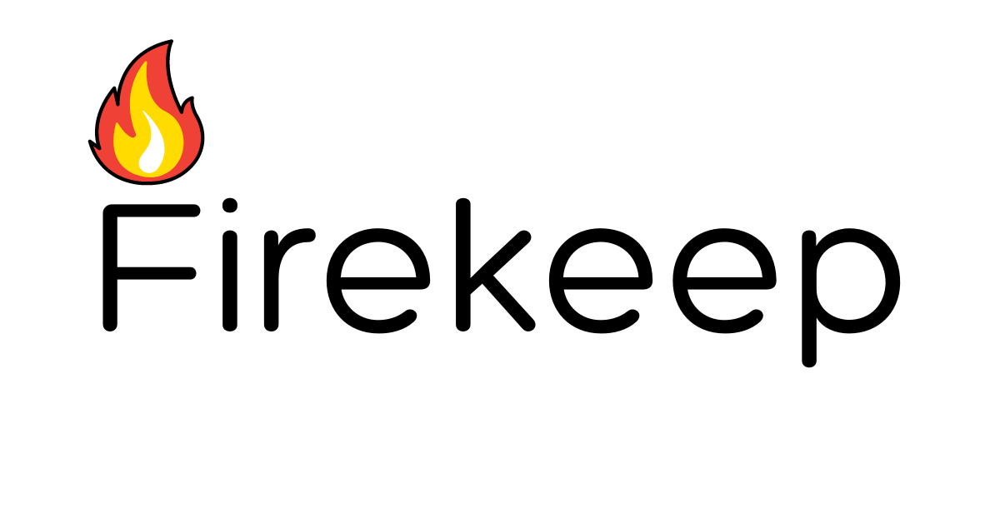

Firekeep is a Flask app that follows Domain-Driven Design, Repository, Service Layer, and CQRS patterns. For educational purposes only. 

## Motivation

I first learned of the CQRS pattern while learning to code in Go. As I went on exploring, I learned of Domain-driven Design, more of the SOLID principles and design patterns. **Btw, I'm not an expert in DDD, SOLID, or software design patterns. My code and writing will obviously show that. Aaaannnnd that's why I built this to learn. Please forgive my ignorance.**

Now, as I went through the documentation of tiangolo's SQLModel (which I did because I was taking inspiration for my code generation project, [reactant](https://github.com/neil-vqa/reactant)), I stumbled upon the [*"main and biggest feature of SQLModel"*](https://sqlmodel.tiangolo.com/tutorial/fastapi/multiple-models/). Then my thoughts went, *Hey, isn't this the CQRS pattern?* And thus a few days later with more articles and books, I decided to build this app. Please don't hesitate to contribute if you find something that bothers you.

Currently using this book for study: *Architecture Patterns with Python: Enabling Test-Driven Development, Domain-Driven Design, and Event-Driven Microservices* by HJW Percival & B Gregory.

## Expected FAQs

1. *Hah! You're applying a pattern for enterprise softwares to a puppy project. Whats the point, man???*

Ans. *Hah! There's actually no point! I'm just wasting my time learning design patterns which I probably will never use!*

2. *What does the application do anyway?*

Ans. Pleae read the [About the Application](#about-the-application) section below.

3. *I dont think thats the CQRS pattern...(with his/her `Optional[explanation]`)*

Ans. Thank you for taking the time to share your knowledge to me. Glad you are here.

## About the Application

Still working on this...

